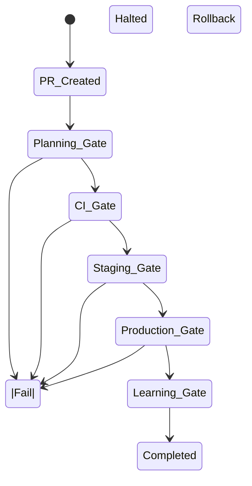

# 🧠 BLUEPRINT v10.3 — flowbiz-ai-builder
## Enterprise / Audit / ISO-Governed Edition

**Human-Inspired, Policy-Driven AI Engineering Platform**  
(MVP → Scale | Autonomous with Explicit Governance)

Multi-Agent • Multi-Repository • CI/CD • Audit-Ready • Evidence-Driven • Self-Improving

> **Governance Principle:**  
> No action is permitted unless it is explainable, traceable, and auditable
> against POLICY.md, CONTROLS.md, and EVIDENCE.md.

---

## 0) Governing Documents (AUTHORITATIVE)

This Blueprint is enforced in conjunction with:

- **POLICY.md** — Governance & Engineering Policy (WHY)
- **CONTROLS.md** — Control Framework & Gates (HOW)
- **EVIDENCE.md** — Evidence & Audit Artifacts (PROOF)

> In case of conflict: **POLICY → CONTROLS → BLUEPRINT → WORKFLOW**

---

## 1) Operating Modes

### 🔒 AUTO_RUN_STRICT (Default / Production)
- Mandatory compliance with POLICY, CONTROLS, and EVIDENCE
- Milestone mapping required
- Missing metadata → CONTROLLED HALT

### 🟡 AUTO_RUN_GUIDED (Human-Authorized Exception)
```md
AUTO_RUN_MODE: GUIDED
AUTHORIZATION_REASON: <documented rationale>
AUTHORIZED_BY: <human owner>
```

Allowed only for:
- Bootstrap
- Exploration
- Non-production refactors

---

## 2) Engineering Control Philosophy

All work must demonstrate the lifecycle:

**Discovery → Planning → Build → Release → Learning**

This lifecycle directly supports:
- ISO 9001 (Quality Management)
- ISO/IEC 27001 (Information Security)

---

## 3) PR Compliance Requirements

A PR is **NON-COMPLIANT by default**.

A PR becomes compliant only if:
- PR Template is complete
- Exactly one milestone is mapped
- Required evidence is attached

PR Template reference:
```
.github/pull_request_template.md
```

---

## 4) Milestone Traceability

**Rule:** 1 PR = 1 Milestone = 1 Scope Lock

Required metadata:
```md
PR_TYPE: MILESTONE | WIP | HOTFIX
MILESTONE_ID: PR-###
BLUEPRINT_REF: BLUEPRINT - Milestone Index / PR-###
```

---

## 5) Gate Framework (Enforced via CONTROLS.md)

| Gate | Control Objective | ISO 9001 | ISO 27001 |
|----|----|----|----|
| Gate -1 Safety | Secure handling | 8.1 | A.8 |
| Gate 0 Planning | Defined requirements | 8.2 | A.5 |
| Gate 1 CI | Verification & validation | 8.5 | A.12 |
| Gate 2 Staging | Controlled change | 8.5.6 | A.14 |
| Gate 3 Production | Release management | 8.6 | A.14 |
| Gate 4 Learning | Continual improvement | 10.1 | A.5 |

Failure at any gate results in **CONTROLLED HALT**.

---

## 6) SAFE / CONTROLLED HALT

When compliance cannot be verified, the system MUST:
- Stop automation
- Preserve state
- Record halt reason (EVIDENCE.md)
- Escalate to human owner

---

## 7) Feature Squad Accountability

- One Feature → One Squad
- One Squad → One Dev Agent
- Orchestrator = Accountable Controller

All actions are attributable to a named role.

---

## 8) Automation & Quality Rule

Any task repeated more than **3 times** must be automated.  
Violation is recorded as a quality non-conformance (ISO 9001 §10).

---

## 9) Evidence Requirements (per EVIDENCE.md)

Each PR must produce or reference:
- Planning evidence
- CI evidence
- Deployment evidence
- Learning evidence

Evidence must be immutable and traceable.

---

## 10) State Machine (Authoritative)



---

## 11) Milestone Index (Single Source of Truth)

(unchanged from v10.2)

PR-11 — Foundation + Human Model + PR Policy  
PR-12 — CI Baseline + Security Scan  
PR-13 — GitHub Adapter v1  
PR-14 — Gate Framework v1  
PR-15 — Evidence Model + Artifact Registry  
PR-16 — Policy Enforcer  
PR-17 — Webhook Watcher & Notifications  
PR-18 — Orchestrator  
PR-19 — BA Agent  
PR-20 — QA Agent  
PR-21 — SRE Agent  
PR-22 — Dev Agent  
PR-23 — Codex Prompt Engine  
PR-24 — Auto Review  
PR-25 — Docker Compose & systemd  
PR-26 — CD Staging Automation  
PR-27 — CD Production & Rollback  
PR-28 — Feature Flags  
PR-29 — Concurrency & Idempotency  
PR-30 — Project Registry  
PR-31 — Repo Readiness Checker  
PR-32 — Onboarding PR Generator  
PR-33 — Multi-Project Deploy Controller  
PR-34 — Post-run Analyzer  
PR-35 — Knowledge Sharing System  
PR-36 — Prompt & Workflow Tuning  
PR-37 — Secrets & Permissions Model  
PR-38 — Core Adapter Boundary

---

## 12) ISO Mapping Checklist (SUMMARY)

### ISO 9001
- 8.2 Requirements → Gate 0 Planning
- 8.5 Production → CI / Staging / Prod Gates
- 8.6 Release → Production Gate
- 10.1 Improvement → Learning Gate

### ISO/IEC 27001
- A.5 Governance → POLICY.md
- A.8 Asset Management → EVIDENCE.md
- A.12 Operations Security → CI & Deployment
- A.14 System Acquisition → Controlled PRs

---

## Final Compliance Statement

> If a change cannot be mapped to POLICY, CONTROLS, and EVIDENCE,
> it must not be automated.

This Blueprint defines an **AI Engineering Organization**
that is enterprise-grade, audit-ready, and safe to scale.
